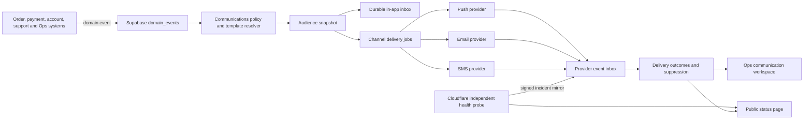
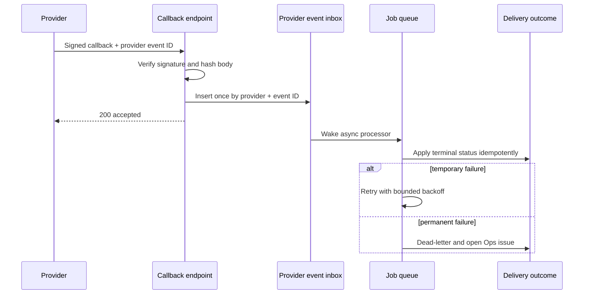

# Drapeon Communications, Notifications, PSA, and Promotions Architecture

Status: implementation contract
Owners: Product, Engineering, Operations, Security, Commercial
Applies to: iOS, Android, web, email, push, SMS, Ops, and public service status

## 1. Outcome

Drapeon uses one communications control plane for transactional updates, operational notices, service announcements, product updates, and promotions. A communication is complete only after its authoritative event, audience, consent decision, inbox record, channel attempts, terminal delivery outcomes, and destination are auditable.

This system does not replace order, payment, payout, refund, dispatch, or account-deletion state. Those systems remain authoritative and emit events. Communications translates those events into the right message, audience, channel, timing, and destination.

## 2. Product Rules

- A counterpart action requiring a decision uses in-app, push, and email.
- SMS is a time-sensitive fallback for mandatory events, not a default broadcast channel.
- Payment, payout, security, safety, account, support, and critical service-status messages cannot be disabled.
- Promotions and product news require explicit consent per channel and default to off.
- Informational lifecycle events remain in the durable inbox and are quieter unless policy elevates them.
- Every message opens the exact app or web context. Generic homepage fallbacks are forbidden.
- Audience membership is snapshotted when a campaign is scheduled so later profile changes cannot silently change who received it.
- Provider callbacks are verified, deduplicated, persisted, and processed asynchronously.
- Evidence URLs, payment secrets, full addresses, and credentials never enter notification payloads, Slack, Sentry, or analytics.

## 3. Taxonomy and Channel Policy

Purposes are `TRANSACTIONAL`, `OPERATIONAL`, and `MARKETING`. Severities are `INFO`, `NOTICE`, `WARNING`, and `CRITICAL`. Categories are owned by `@drape/shared/communications`.

| Event | Purpose | Default channels | Can opt out? |
|---|---|---|---|
| Order lifecycle information | Transactional | In-app | Yes, except required decisions |
| Quote, approval, handoff, payment action | Transactional | In-app, push, email | No for the required decision |
| Messages | Transactional | In-app, push | Yes for push, never for inbox |
| Payment, refund, payout | Transactional | In-app, push, email | No |
| Account, privacy, security | Operational | In-app, push, email; SMS fallback when critical | No |
| Safety and urgent support | Operational | In-app, push, email; SMS fallback when justified | No |
| Service degradation | Operational | In-app and public status; push/email by impact | Critical messages: no |
| Product update | Marketing | In-app, optionally push/email | Yes; consent required outside inbox |
| Promotion or discount | Marketing | In-app, optionally push/email/SMS | Yes; explicit channel consent required |

## 4. Architecture

Supabase owns account communication state, consent, inbox records, campaigns, audience snapshots, jobs, attempts, and audit outcomes. Cloudflare remains an independent service-health observer so a Supabase incident can still be communicated publicly. Cloudflare may mirror a signed incident into the provider-event inbox, but cannot mutate order or money state.

## 5. Data Model

- `communication_preferences`: per-user category/channel preference. Mandatory policy overrides it at send time.
- `communication_consents`: immutable consent history for marketing channels and policy versions.
- `communication_inbox`: durable user-visible message, exact destination, read/ack state, expiry, and correlation identifiers.
- `communication_templates` and `communication_template_versions`: reviewed copy and rendering contracts; published versions are immutable.
- `communication_campaigns`: PSA, service-status, product-update, or promotion lifecycle, audience query, schedule, risk, approvals, and optional commercial-campaign reference.
- `communication_campaign_recipients`: frozen audience plus per-channel terminal summary.
- `communication_suppressions`: bounced, complained, invalid, user-requested, or Ops suppression scoped to purpose/channel.
- `communication_provider_events`: raw callback envelope hash, deduplication key, verification and processing state.
- `service_incidents`: customer-safe service state, impact, start/end, resolution, and public visibility.

Existing `domain_events`, `job_queue`, `job_attempts`, `notification_delivery_outcomes`, push-token tables, commercial campaigns, and Slack outbox remain authoritative in their existing scopes.

## 6. APIs

Authenticated mobile and web clients use the same `communications-action` Edge function:

- `PREFERENCES_GET`
- `PREFERENCE_SET`
- `CONSENT_SET`
- `INBOX_LIST`
- `INBOX_MARK` (`READ`, `UNREAD`, `ACKNOWLEDGED`)
- `STATUS_LIST`

Writes bind to the JWT user. Marketing enablement records an explicit consent event. The API never accepts a client claim that an event is mandatory. Campaign creation, approval, scheduling, cancellation, and resend are Ops-only server actions and require risk-appropriate independent approval.

Provider callbacks follow this sequence:

## 7. Frontend Contracts

### Mobile (iOS and Android)

- Notification center reads `communication_inbox`; local order/message reconstruction is transitional fallback only.
- Settings show transactional categories separately from marketing consent. Mandatory categories explain why their required messages stay on.
- Unread counts update through realtime and clear only after authoritative marking.
- Critical PSAs appear as a compact dismissible banner; acknowledgement-required PSAs remain until acknowledged.
- Push taps sanitize and open the exact route with role-safe fallback.
- Permission denial shows remediation without repeatedly prompting.

### Web

- Account notification center and preferences use the same Edge actions and status language.
- Responsive layouts preserve keyboard, focus, reduced-motion, and screen-reader behavior.
- `/status` remains readable without authentication and distinguishes operational status from account-specific incidents.
- Browser push is additive; the durable inbox is the fallback.

### Ops

- Queue-first communications workspace: drafts, awaiting approval, scheduled, sending, attention needed, and history.
- Campaign workspace shows audience preview/snapshot, consent exclusions, channel cost/risk, templates, schedule, approvals, provider outcomes, and exact deep links.
- Incident workspace shows service impact and channel plan without exposing customer secrets.
- Completed campaigns and incidents collapse into history.
- Every action has loading, success, blocked, and terminal-failure acknowledgement.

## 8. Promotions and Discounts

Discount creation remains in the commercial engine. Ops Promotions references the commercial campaign/code rather than cloning benefit or ledger logic. A promotion cannot schedule until the linked code is active for the same audience and time window. Redemption, budget, and liability remain commercial-ledger concerns; communication owns delivery only.

High-risk or broad campaigns require two independent approvals. Low-risk account lifecycle templates can be pre-approved. Emergency service notices may use a documented break-glass path that records the operator, reason, scope, expiry, and retrospective review.

## 9. Reliability, Cost, and Privacy

- Persist before send; acknowledge callbacks quickly; process asynchronously.
- Idempotency is provider + event ID for callbacks and recipient + campaign + channel for sends.
- Exponential backoff is bounded by the event expiry. Permanent failures dead-letter and create an Ops issue.
- Email complaints and hard bounces suppress future optional email. Invalid push tokens are disabled. STOP suppresses optional SMS immediately.
- Mandatory communications may switch to an allowed alternate channel but never bypass legal SMS or email suppression rules.
- Audience estimates include expected push, email, and SMS cost before approval.
- Rate limits apply per recipient, campaign, and category; critical events bypass quiet hours but not abuse controls.
- Logs use safe IDs and correlation keys. Message bodies are excluded from routine Sentry breadcrumbs.

## 10. Tradeoffs

- A single control plane increases consistency but creates a central dependency. Durable inbox writes and Cloudflare status independence reduce that risk.
- Audience snapshots consume storage but make delivery and consent audits reproducible.
- Conservative marketing defaults reduce reach but protect consent and sender reputation.
- SMS materially improves critical reach but adds cost and regulatory exposure, so it remains explicit fallback.
- Templates improve consistency but require versioning; published versions therefore remain immutable.

## 11. Rollout and Dry Run

1. Apply schema and RLS to development; seed default preferences without enabling marketing.
2. Deploy the common Edge API and dual-read legacy metadata during transition.
3. Migrate mobile and web inbox/preferences, then remove local reconstruction only after parity.
4. Add Ops campaigns/incidents and public status.
5. Prove a transactional decision, critical PSA, promotion opt-in/out, provider bounce, invalid push token, STOP suppression, duplicate callback, retry, and dead-letter.
6. Verify physical iPhone and Android notification receipt and exact-context deep links, plus narrow/desktop web.
7. Confirm email, push, SMS, Slack, Sentry, and Ops outcomes are terminal and correlated.
8. Promote to production only after consent, security, cost, and sender-domain review.

Production acceptance requires no test endpoints, test labels, evidence URLs, credentials, or DEV audience bridges in release artifacts.
