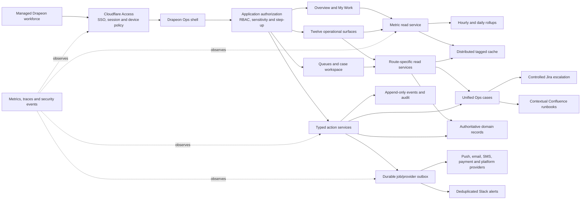
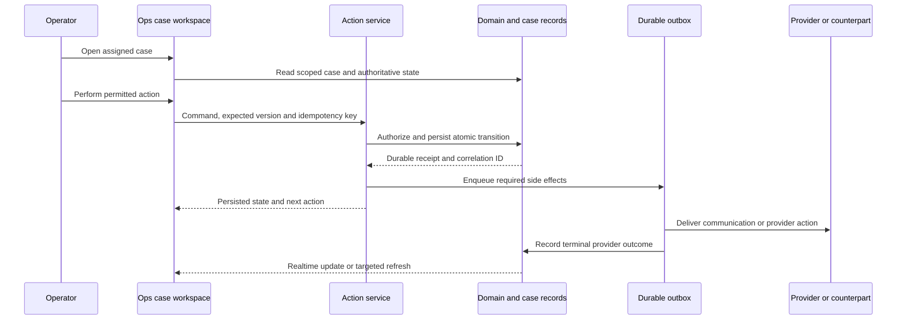

# Drapeon Ops Control Plane — Post-Submission Rebuild

Status: Approved design direction; implementation deferred until Apple and Google submission work is complete.

## Summary

Drapeon Ops will become a secure, queue-and-case-based control plane for operating a global custom-fashion marketplace. It will replace the current monolithic `/ops` page incrementally, not through a big-bang rewrite.

The control plane must let a new employee answer four questions immediately:

1. What needs attention?
2. Who owns it?
3. What is the next permitted action?
4. What proof shows the workflow reached a durable outcome?

The product combines Drapeon-owned live operations with controlled links to external tools:

- Drapeon Ops owns customer, tailor, order, trust, fulfillment, money, communication, and provider state.
- Jira owns engineering delivery after escalation.
- Confluence owns durable policy, training, and runbooks.
- Slack is an alert and collaboration surface, never the authoritative record.

## Delivery Boundary

### Before store submission

- Finish Apple and Google submission readiness.
- Make only submission-blocking or production-stability changes to Ops.
- Do not start the interface rewrite, broad schema changes, or release builds unrelated to submission.

### After store submission

1. Build the shared shell, My Work, unified cases, queues, cache, security, and telemetry behind feature flags.
2. Migrate submission-critical operations: deletion, support, verification, communications, and incidents.
3. Add marketplace, customer, tailor, order, Vision, delivery, money, showcase, and reporting surfaces.
4. Retire the legacy monolith only after parity, production canaries, and a rollback window.

## Product Principles

- **Actionable over decorative.** Every metric and chart segment opens the exact filtered queue or case set behind it.
- **My Work over the well.** Employees land on assigned and urgent work, not every department's data.
- **One case envelope.** Domain records remain authoritative, while actionable work projects into one assignable, SLA-tracked case model.
- **Broad visibility, narrow authority.** Read access and action authority are separate; sensitive decisions use step-up and separation of duties.
- **Durable outcomes.** A local success message, HTTP 2xx, or queued job is not completion proof.
- **Partial failure over blank screens.** Routes stream independently and always provide recovery, exit, and retry paths.
- **Global marketplace representation.** Showcase, supply, and quality reporting must cover cultures, regions, garment types, styles, and occasions without treating Drapeon as Africa-only.

## Users and Operating Model

| Persona | Default home | Primary responsibility |
| --- | --- | --- |
| Frontline operations | My Work | Intake, triage, evidence requests, routine queue movement |
| Customer Success | My Work / Customer Experience | Support, order communication, disputes, follow-up |
| Trust | My Work / Trust & Safety | Verification, moderation, safety, deletion decisions |
| Finance | My Work / Money Desk | Payment, refund, reconciliation, payout readiness |
| Engineering/on-call | Incidents | Reliability, provider failures, workflow defects |
| Leadership | Overview | Health, risk, capacity, trends, escalation |
| Administrator | Access control | Roles, groups, reviews, emergency access |

Desktop is the daily work environment. Tablet supports safe triage and approved critical actions. Phone supports alerts and authenticated deep links, not full administration.

## Information Architecture

```text
Overview                  health, risk, trends, and leadership signals
My Work                   personally assigned, urgent, and approval work
Marketplace Control Tower end-to-end marketplace health
Customer Experience       support and customer outcomes
Tailor Network            supply, capacity, quality, and readiness
Orders & Production       custom-garment lifecycle
Measurements & Vision     measurement and native capture health
Communications            push, email, SMS, in-app, and conversation outcomes
Trust & Safety            verification, moderation, safety, and deletion
Delivery & Supply         fabric, inventory, dispatch, and delivery
Money Desk                payments, refunds, reconciliation, and payout readiness
Reliability & Incidents   application, provider, callback, and queue health
Showcase Quality          Explore supply and merchandising quality
Reports & Audit           historical performance, exports, access, and proof
Knowledge                 contextual Confluence runbooks
Access control            workforce groups, reviews, and break-glass
```

Canonical routes:

```text
/ops/overview
/ops/my-work
/ops/queues/[queueKey]
/ops/cases/[caseNumber]
/ops/incidents
/ops/reports
/ops/knowledge
/ops/admin/access
```

Legacy `?view=` links redirect to canonical routes. Unknown or unauthorized destinations show a recoverable state with Back to Drapeon, My Work, switch-account, and retry options. They must never fall through to the expensive overview loader.

## Interaction and Visual System

The interface uses an **operational calm** direction: Drapeon's warmth and typography with compact, high-signal work surfaces rather than oversized editorial cards or Jira-level visual noise.

- Persistent left navigation, global search, environment marker, identity, and alert state.
- Compact queue table with cursor pagination, saved filters, sortable columns, bulk selection only where actions are safely reversible.
- List/detail split pane on desktop; list-to-detail navigation on tablet.
- Case header always shows priority, SLA, status, assignee, sensitivity, related entity, and next action.
- Case body combines authoritative domain state, evidence, timeline, internal notes, provider outcomes, and contextual runbook.
- One dominant action per state; secondary actions live inline or in a compact menu.
- Loading uses stable skeleton geometry. Section failures use local error boundaries and announced recovery actions.
- Full keyboard operation, skip links, logical focus order, visible focus rings, reduced-motion support, non-color status indicators, and 4.5:1 text contrast.
- Charts include titles, definitions, targets, visible values, accessible data tables, patterns/labels in addition to color, and keyboard-operable drill-down.

## Overview and Metrics Dashboard

`/ops/overview` is the operational front door for health and trends. `My Work` remains the default landing page for ordinary employees.

### Global controls

- Time range: 7, 30, or 90 days.
- Environment: production by default; development and test are unmistakably labeled.
- Optional department, region, platform, app version, provider, and severity filters.
- Last-updated timestamp and data-freshness state.
- Metric definition and owner available from every card or chart.

### KPI strip

- Open cases
- Critical incidents
- Breached first-response SLAs
- Breached resolution SLAs
- Waiting-on-provider cases
- Unassigned queue backlog

Each KPI links to its canonical filtered queue. Example:

```text
/ops/queues/verification?sla=breached
```

### Required visualizations

| Operational question | Visualization | Drill-down |
| --- | --- | --- |
| Are incidents increasing? | Created-versus-resolved line chart | Incidents for selected date/status |
| Which team is overloaded? | Horizontal assigned/unassigned backlog bars | Team queue with ownership filter |
| Are departments meeting SLAs? | First-response and resolution percentage bars with targets | Breached cases for the department |
| Where are cases stuck? | Received → triaged → in progress → waiting → resolved funnel | Cases at the selected stage |
| How old is the backlog? | Stacked bars: `<1h`, `1–4h`, `4–24h`, `>24h` | Queue filtered by age bucket |
| Are providers healthy? | Status matrix with latency/error sparklines | Provider incidents and failed jobs |

### Required operational panels

- Communication outcomes: queued, provider accepted, delivered, failed, opened, and dead-lettered.
- Recent critical incidents: owner, severity, impact, started time, duration, state, and case link.
- Latest recoveries and unresolved provider degradation.
- Work requiring two-person approval.

Provider health covers Supabase, Cloudflare, Expo Push, email, SMS, Stripe, Paystack, Daily, Sentry, and Slack. A green public vendor status page is never sufficient; every critical dependency also needs a bounded Drapeon-owned synthetic check.

Metrics come from authoritative case events, domain transitions, durable job outcomes, and provider outcomes. Historical charts read hourly/daily rollups rather than issuing expensive scans across every production domain table.

## My Work

`/ops/my-work` shows only work relevant to the authenticated operator:

- assigned and claimed cases;
- approaching and breached SLAs;
- approvals requiring their role;
- escalations awaiting acknowledgement;
- cases returned by a customer, tailor, provider, or another department;
- waiting cases whose follow-up time has arrived;
- recently changed cases and shift-handoff notes.

Default ordering is severity, breached/approaching SLA, next action time, then oldest untriaged work. The employee can never lose entered notes or evidence when claiming, escalating, or changing a case.

## Twelve Operational Surfaces

### 1. Marketplace Control Tower

- Successful-order, cancellation, dispute, refund, and on-time-delivery rates.
- Live order-stage distribution and p90 stage duration.
- Orders at risk, stalled, changed after approval, or awaiting a counterpart.
- Marketplace supply, demand, geographic coverage, and category gaps.
- Customer and tailor responsiveness.

### 2. Customer Experience

- Support backlog, first meaningful response, resolution, and repeat-contact rate.
- Cancellation, refund, dispute, fit, measurement, and delivery reasons.
- Customers blocked in onboarding, authentication, checkout, or account deletion.
- Repeat purchase and successful reorder rate.
- Segmentation by platform, app version, region, order stage, and acquisition source.

### 3. Tailor Network

- Active, onboarding, unavailable, restricted, and suspended tailors.
- Verification backlog and approval time.
- Workload versus declared capacity.
- Acceptance, response, on-time completion, cancellation, dispute, alteration, and refund rates.
- Notification reachability, recent activity, geographic coverage, and garment-category coverage.
- Quality signals must display evidence, sample size, and volume context rather than a simplistic punitive score.

### 4. Orders & Production

```text
Inquiry → Consultation → Measurements → Design approval
→ Fabric sourcing → Production → Fitting → Dispatch
→ Delivered → Aftercare
```

- Median and p90 time at every stage.
- Promised-delivery risk and overdue counterpart responses.
- Fabric substitutions, design changes, fittings, alterations, and rework.
- Replacement flows such as pickup-to-delivery changes.
- Once a replacement becomes authoritative, superseded credentials and actions disappear from every surface.

### 5. Measurements & Vision

- Scan attempts and completion rate.
- First-, second-, and third-run success.
- Retake, camera-permission, native-runtime, and manual-fallback reasons.
- Device/model-specific failures and low-confidence results.
- Measurements adjusted after tailor review and orders blocked by missing measurements.
- Aggregate dashboards never expose body imagery or unnecessary measurement detail.

### 6. Communications

- Push, email, SMS, in-app, and conversation outcomes.
- Queued, provider-accepted, delivered, opened, failed, suppressed, and dead-lettered states.
- Event-to-provider and event-to-delivery latency.
- Notification deep-link correctness.
- Users without a reachable channel and conversations awaiting a customer or tailor.
- Duplicate suppression and provider recovery.

### 7. Trust & Safety

- Randomized challenge-video verification funnel and review SLA.
- Marketplace visibility, portfolio, review, and content moderation.
- Suspicious accounts, orders, contact bypass, pressure, harassment, or circumvention.
- Appeals, overturned decisions, repeat behavior, and safety reports.
- Trust approval controls marketplace visibility; payout-provider capability separately controls paid orders and earnings release.

### 8. Delivery & Supply

- Fabric sourcing delays, substitutions, and inventory shortages.
- Pickup and dispatch backlog.
- Delivery exceptions, failed pickups, stale tracking, and lost/damaged garments.
- Carrier and regional performance.
- Repeated tailor sourcing or dispatch failures.

### 9. Money Desk

- Payment, refund, reconciliation, and provider-webhook states.
- Payout-readiness blockers and tailors blocked from paid work.
- Separation of preparation, approval, and execution.
- Two-person approval for defined high-risk actions.
- Provider state must say `TEST`, `PRODUCTION DISABLED`, `DEGRADED`, or `LIVE`; intentionally disabled services never receive a misleading healthy badge.

### 10. Reliability & Incidents

- Created-versus-resolved incidents and active severity.
- Mean time to acknowledge, mitigate, recover, and resolve.
- Affected workflow, app version, provider, callback, queue, and customer/tailor surface.
- Supabase health, Disk I/O, connections, scheduler churn, advisors, and queue/dead-letter depth.
- Cloudflare, Expo, email, SMS, Daily, Stripe, Paystack, Sentry, and Slack status plus Drapeon synthetic results.
- Critical engineering incidents create or update Jira automatically; ordinary cases require explicit escalation.

### 11. Showcase Quality

- Approved profiles with complete portfolios, availability, pricing, and strong imagery.
- Global geographic, cultural, style, garment, and occasion coverage.
- Search queries with weak or zero results.
- Impression → profile → inquiry → order conversion.
- Stale or unavailable profiles and category/region supply gaps.
- Screenshot and marketing showcase accounts remain isolated, realistic, diverse, and removable after use.

### 12. Reports & Audit

- SLA, workload, case volume, outcome, communication, incident, and marketplace history.
- Access changes, break-glass activity, sensitive decisions, and provider outcomes.
- Scheduled leadership summaries and permission-aware CSV exports.
- Every metric records its definition, owner, target, source, aggregation grain, retention, and known limitations.
- Staff performance reporting includes workload and case complexity context and must not become an unexplained ranking score.

## Unified Case Model

Existing domain records remain authoritative. The existing `ops_issues` concept evolves into a common operational envelope containing:

- case number, type, team, and queue;
- priority, severity, sensitivity, and status;
- assignee, claimed time, next action, and last activity;
- first-response and resolution deadlines plus SLA policy version;
- related customer, tailor, order, provider, and domain entity references;
- dedupe key, correlation ID, and optimistic concurrency version;
- Jira, Confluence, incident, and external references;
- created, updated, escalated, resolved, and closed timestamps.

Canonical statuses:

```text
NEW
TRIAGED
IN_PROGRESS
WAITING_CUSTOMER
WAITING_COUNTERPARTY
WAITING_PROVIDER
BLOCKED
ESCALATED
RESOLVED
CLOSED
```

Compatibility mappings preserve existing `OPEN`, `IN_REVIEW`, `ESCALATED`, and `RESOLVED` records during migration.

Typed case events form the timeline. Internal notes, state transitions, audit entries, provider outcomes, communication outcomes, and links are distinct event types with explicit visibility and redaction policies.

## Public Service Contracts

```text
getOpsOverview(range, filters)
getOpsMetricSeries(metric, range, filters)
getProviderHealth(filters)
getWorkflowFunnel(range, filters)
listOpsQueue(queueKey, filter, sort, cursor)
getOpsCase(caseNumber)
claimOpsCase(caseNumber, expectedVersion)
transitionOpsCase(command, expectedVersion, idempotencyKey)
escalateOpsCase(destination, reason, expectedVersion)
exportOpsReport(report, filters)
```

Every mutation returns a durable receipt with case ID, human status, timestamp, resulting version, correlation ID, persisted transition, queued side effects, known provider outcomes, and next action.

Database and Edge transitions remain authoritative. UI validation is additive. Cursor pagination and indexed filtering are mandatory; a route may not fetch every department to render one workspace.

## System Architecture



## Workflow Contract



Back, X, cancel, swipe, hardware back, save completion, reload, re-entry, cold start, and deep-link entry use the same contextual route contract. A case never returns an operator to a guessed homepage or sibling queue.

## Metrics and Rollups

Metrics are products with definitions, not incidental SQL counts.

Each metric definition includes:

- stable key and human name;
- business definition and exclusions;
- source events and authoritative records;
- aggregation grain and timezone;
- dimensions and permitted filters;
- target and warning/critical thresholds;
- freshness target and late-event behavior;
- owner and escalation route;
- sensitivity and retention classification.

Hourly rollups support recent operational analysis. Daily rollups support 30/90-day reporting. Idempotent recomputation handles late or corrected events. Rollups retain links to source case/event identifiers for reconciliation without duplicating sensitive payloads.

Critical provider and incident health remains near-real-time. Historical charts do not perform unbounded live scans.

## Caching and Performance

Replace the process-local 15-second dashboard cache and OpenNext dummy cache with a distributed cache compatible with the deployed Cloudflare/OpenNext version. Cross-instance tag invalidation is mandatory.

Target tags:

```text
ops:overview
ops:metrics:{metric}:{range}
ops:provider-health
ops:case:{caseId}
ops:queue:{queueKey}
ops:summary:{team}
ops:reference:{type}
```

Cache policy:

| Data | Policy |
| --- | --- |
| Case details and My Work | No shared cache; read-your-own-write |
| Messages, addresses, evidence, access, payment, sensitive measurements | Never shared-cache |
| Provider and critical incident health | Near-real-time, bounded short cache |
| Queue summaries and badges | 10–30 seconds, stale-while-revalidate |
| Safely scoped queue pages | 3–10 seconds keyed by role, team, filter, sort, cursor |
| Overview summaries | 30–60 seconds |
| Historical rollups | Up to 5 minutes |
| Reference data and runbook metadata | 5–15 minutes |

Successful mutations invalidate only the affected case, queue, team summary, provider state, and metrics. Correctness must not depend on cache freshness.

Initial SLOs:

- authenticated shell TTFB p95 below 800 ms;
- Overview, first queue page, and case detail p95 below 1.5 seconds;
- local action acknowledgement p95 below 2 seconds, excluding external completion;
- bounded query count per route and no dashboard-wide fan-out;
- no blank page during a recoverable dependency failure.

## Security Architecture and Proof

Cloudflare Access, application authorization, and database/Edge enforcement independently fail closed.

- Managed `@drapeon.co` identities and workforce groups are the normal access path.
- Long-lived person-by-person grants are replaced by group-based department roles.
- Fresh MFA/step-up is required for deletion approval, access changes, trust decisions, refunds, payouts, and destructive actions.
- Break-glass access requires two authorized people, lasts at most 15 minutes, alerts immediately, expires automatically, and requires a retrospective.
- Service tokens are restricted to scoped automation routes and have rotation/revocation records.
- Every action uses schema validation, strict origin/CSRF checks, rate limits, idempotency, optimistic concurrency, and explicit action authorization.
- Evidence uses short-lived signed access.
- Secrets, customer addresses, body imagery, measurement details, payment credentials, evidence URLs, and private messages never enter logs, Slack, Jira, or general telemetry.
- Audit records are append-only and exported to retention-controlled storage.

Required security proof:

- role/action allow-and-deny matrix;
- Access JWT issuer, audience, expiry, identity, group, replay, and stale-session tests;
- direct-object-reference and cross-tenant tests;
- fresh-MFA and break-glass expiry tests;
- mutation idempotency and concurrent-update tests;
- audit completeness assertions;
- secret, dependency, and static-analysis scanning;
- authenticated penetration-test checklist and incident tabletop;
- quarterly access reviews and immediate offboarding verification.

This is ASVS-aligned security engineering, not a claim of formal certification.

## Observability and Incident Proof

Record and alert on:

- route p50/p95/p99, errors, Worker CPU, and subrequests;
- database query count/latency, Disk I/O, connections, scheduler churn, and Advisors;
- cache hit, miss, revalidation, and invalidation failures;
- queue and dead-letter depth;
- failed callbacks and webhooks;
- job attempts and provider terminal outcomes;
- auth denials, step-up failures, sensitive actions, and break-glass use;
- exact deployed Worker, Edge function, migration, and client versions.

Correlation IDs connect Access requests, cases, actions, audit events, jobs, callbacks, provider outcomes, and Jira escalations. Slack alerts include severity, affected surface, first failure, current state, authenticated Ops deep link, owner, and next action without sensitive payloads. Recovery produces a deduplicated recovery update.

## Jira, Confluence, and Ownership

- Critical system cases automatically create or update a Jira issue.
- Ordinary engineering escalation requires an explicit permitted action and reason.
- Every Jira link carries the Drapeon case number and correlation ID.
- Confluence runbooks are linked by queue, case type, stage, and provider; Ops caches metadata only and does not become a document editor.
- Every queue defines its owner, workforce groups, triage policy, SLA, escalation destination, allowed actions, runbook, and after-hours behavior.

## Migration and Rollout

1. Create an ADR, data classification, threat model, metric catalogue, SLA catalogue, RBAC matrix, route map, cache matrix, and migration backlog.
2. Build the shell, My Work, queue/case primitives, access controls, distributed cache, metric service, and telemetry behind feature flags.
3. Evolve cases and events using separate schema, backfill, security, and scheduler migrations; apply and verify development first and promote no more than five reviewed migrations per production batch.
4. Migrate deletion, support, verification, communications, and incidents first.
5. Dual-read legacy and new paths and compare counts, permissions, state, latency, and query volume.
6. Add the remaining operational surfaces incrementally.
7. Run role-based UAT using realistic customer, tailor, provider, failure, retry, duplicate, and recovery states.
8. Canary Cloudflare deployments and monitor the actual production database, cache, callbacks, queues, providers, and synthetic paths.
9. Remove the monolith only after parity, a stable canary, and an observed rollback window.

## Acceptance Criteria

- An employee can identify ownership, urgency, SLA, and next action without opening every department.
- Every KPI and chart reconciles with authoritative records and opens the exact filtered queue.
- Metrics remain correct across retries, duplicates, late events, corrected events, time zones, and status changes.
- Deletion, support, verification, communication, order, and incident cases can be claimed, processed, audited, reloaded, deep-linked, and completed end to end.
- Unauthorized identities and roles are denied at Access, application, action, and database boundaries.
- Sensitive actions require fresh MFA and separation of duties; expired sessions and stale concurrent edits fail safely.
- Cache invalidation provides read-your-own-write behavior without clearing unrelated queues.
- A provider or section failure renders a recoverable local state rather than a blank application.
- Keyboard-only desktop use and tablet emergency triage pass accessibility testing.
- Critical cross-role workflows prove authoritative persistence, counterpart update, terminal communication outcomes, real-device deep links, and the adjacent/reverse path.
- Production canaries meet latency, query-count, cache, queue-health, security, and audit-completeness targets.

## Assumptions

- Implementation begins after Apple and Google submission work.
- The twelve surfaces are the complete target architecture, not twelve simultaneous build streams.
- Existing domain records remain authoritative; existing Ops cases, audit logs, and outboxes are evolved rather than discarded.
- Workforce access uses managed Drapeon SSO, controlled Jira automation, contextual Confluence knowledge, and two-person break glass.
- Paystack and ZIP tax stay explicitly disabled until business readiness and do not block the architecture.
- No App Store or Play Store release build is created as part of this redesign.
