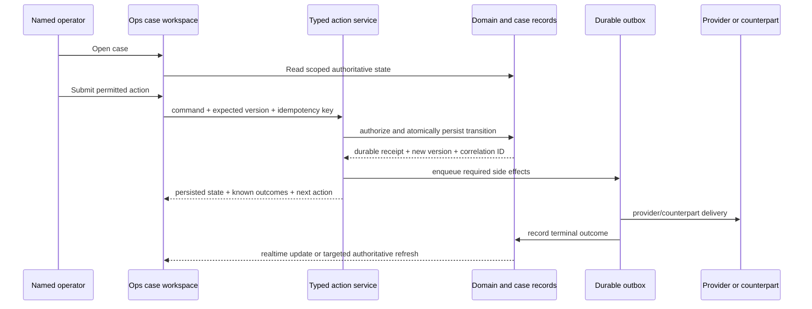

# Drapeon Ops Control Plane — Canonical Product, Security, and Delivery Design

Status: Approved implementation design

Owner: Founder / Operations

Technical owner: Engineering

Last reviewed: September 10, 2026

Supersedes: every earlier Ops redesign outline; supporting security, SLA, monitoring, and runbook documents remain inputs, not competing product specifications.

## 1. Decision Summary

Drapeon Ops will become a secure, installable, queue-and-case-based control plane for operating the entire marketplace. It will replace the current monolithic `/ops?view=` surface incrementally, beginning with production-safety repairs and one complete operational workflow rather than a shell-first rewrite.

The control plane must let an operator answer five questions without searching across unrelated panels:

1. What needs attention?
2. Who owns it?
3. What is the recommended next action?
4. What other actions are permitted?
5. What durable proof shows the workflow reached its outcome?

The following decisions are fixed before route or UI migration begins:

| Decision | Chosen direction |
| --- | --- |
| Production identity | Cloudflare Access workforce identity only; no shared-token fallback in production. |
| Database authority | New Ops surfaces use short-lived per-operator workforce claims and role-scoped database views/RPCs. General service-role access is not the authorization model. |
| Sensitive step-up | A separate Cloudflare Access application/audience protects sensitive routes and requires a newly satisfied IdP MFA policy. A normal Access JWT `iat` is not accepted as proof of recent MFA. |
| Consistency | Authoritative case, money, evidence, permission, and action-eligibility reads are never shared-cached. |
| Public safety caching | Safety, legal, fraud, suspension, and inventory-removal transitions create immediate tombstones and invalidate one owned public-cache layer. |
| Monitoring | The Cloudflare Worker is the canonical production synthetic and state owner. Development monitoring has separate state and notification routing. GitHub is manual/fallback only. |
| Deploy boundary | Ops moves to its own deployable application on `ops.drapeon.co`; the existing hostname and Access boundary are preserved throughout migration. |
| Initial operating size | Design for one to three launch operators. High-risk single-operator exceptions use an audited founder override and mandatory retrospective, not fictional two-person approval. |
| Mobile access | Ops is installable as a PWA for alerts and safe triage. Money movement, deletion execution, trust approval, and access administration remain desktop-only. |

## 2. Product Boundary

Drapeon Ops owns operational truth and action execution for:

- customers and authentication;
- tailors, onboarding, trust verification, marketplace readiness, and capacity;
- custom and ready-made orders;
- consultations, messages, measurements, and Drapeon Vision;
- materials, production, fittings, fulfilment, dispatch, and delivery;
- payments, refunds, reconciliation, payouts, and provider callbacks;
- notifications and communication delivery;
- support, disputes, deletion, safety, moderation, and appeals;
- incidents, service health, release state, and provider degradation;
- audit, access, exports, and operational reporting.

External tools have narrower ownership:

- Jira owns engineering work after an explicit or automatic engineering escalation.
- Confluence owns durable policies, training material, and long-form runbooks.
- Slack delivers deduplicated alerts and supports collaboration; it is never the incident or case ledger.
- Supabase domain records, database functions, Edge transitions, and durable job outcomes remain authoritative.

This redesign does not introduce government-ID collection or biometric templates. Drapeon trust review remains the private randomized challenge video plus profile and portfolio evidence. Payout providers own regulated payout KYC.

## 3. Operating Principles

- **My Work first.** Ordinary employees land on assigned, urgent, or approval work, not a wall of company data.
- **One operational envelope.** Domain records remain authoritative; actionable work projects into one assignable, SLA-tracked case.
- **One recommended action.** The likely next action is prominent; all other permitted actions are discoverable in one click. Operators always have a safe “this case is unusual” escalation path.
- **Broad visibility, narrow authority.** Read permission never implies action permission.
- **Durable outcomes.** A toast, HTTP 2xx, or queued job is not completion proof.
- **Correct before fast.** Stale information must never inform an irreversible action.
- **Partial failure over blank screens.** A failed panel stays local and explains recovery.
- **Evidence minimization.** Show only what the operator needs for the current decision.
- **Explain every number.** Metrics link to the exact case or event set behind them.
- **No environment ambiguity.** Production and development differ in origin, deployment, credentials, data, notification sinks, monitoring state, and visual chrome.
- **No invented policy.** Cases outside written authority escalate rather than forcing a wrong transition.

## 4. Pre-Redesign Production Hardening

No new Ops route ships until this phase is complete. These are corrections to the current control plane, not optional redesign features.

### 4.1 Access and mutation boundary

1. Production asserts `getOpsAccessMode() === 'cloudflare-access'` at build and runtime.
2. Remove `OPS_ALLOW_BOOTSTRAP_IN_PRODUCTION`; production also rejects the presence of `OPS_DASHBOARD_TOKEN`.
3. Unknown, missing, or misspelled roles deny access. No role normalizer defaults to `admin`.
4. Every mutation validates the canonical production Origin and requires same-origin fetch metadata. Missing or mismatched values fail closed.
5. Redirects use configured canonical origins and preserve a sanitized canonical route, including `/ops/cases/*`, through Access login.
6. Add a revocation check keyed by workforce principal/session so offboarding can invalidate access before Access JWT expiry.
7. Access signing certificates may use a bounded stale copy during certificate-endpoint degradation, with an explicit degraded-auth health signal. Expired or unrecognized keys still deny access.

### 4.2 Monitoring source of truth

1. The Cloudflare health Worker becomes the only scheduled production synthetic.
2. Production uses its own Worker deployment, KV namespace, state key, Slack channel, secrets, and Ops environment.
3. Development uses a separate Worker/state key and a non-paging destination; it runs at a lower cadence or on demand.
4. Missing production readiness credentials are a critical monitor failure everywhere.
5. The GitHub workflow becomes `workflow_dispatch` plus an explicit fallback path; it no longer runs a second five-minute production schedule.
6. Add a dead-man check for a production monitor state older than twelve minutes.
7. Healthy checks stay in a digest. Incident and recovery transitions alert once per fingerprint.

### 4.3 Correctness-sensitive caching

1. Remove the process-local Ops dashboard cache from action-adjacent reads.
2. Preserve post-mutation read-your-own-write as an explicit service contract, not a side effect of `notice` or `error` query parameters.
3. Pulse counts may remain briefly cached, but never determine whether an action is permitted.
4. Ship safety tombstones before broader public-cache consolidation. A removed or restricted entity cannot be returned from last-known-good data.

### 4.4 Evidence and push

1. Proxy trust evidence through the Access-protected application with `Cache-Control: private, no-store` and `Referrer-Policy: no-referrer`.
2. Record access intent and terminal outcome separately. Failed delivery must not look like successful evidence access.
3. Require a case-linked reason, per-operator rate limits, and alerts for unusual evidence volume.
4. Ops push endpoints are allowlisted to supported push-service hosts, bound to a workforce principal and device, capped per principal, and revocable.
5. Add explicit unsubscribe, last-authenticated-at, failure count, and automatic expiry.
6. Resolve current role and access at send time; stored role is informational only.

## 5. Environment and Data Isolation

### 5.1 Environment matrix

| Boundary | Production | Development / QA |
| --- | --- | --- |
| Origin | `ops.drapeon.co` | dedicated non-production origin |
| Deployment | production Ops Worker/app | separate preview/dev deployment |
| Supabase project | production ref only | development ref only |
| Access application | production audience and groups | separate development audience/groups |
| Provider credentials | live or explicitly `PRODUCTION_DISABLED` | test/sandbox only |
| Email/SMS/push | real users according to preferences | allowlisted sinks or sinkhole |
| Monitoring state | production KV namespace | separate development KV namespace |
| Slack | production incident channel | development/QA channel or digest |
| Sentry | production DSN/environment | development DSN/environment |
| Cache namespace | production release/environment key | development release/environment key |
| PWA identity | production manifest, icons, scope | separate name, icon treatment, scope |

The production UI uses a persistent patterned left-edge marker, the word `PRODUCTION`, and the observed runtime target. Development changes both chrome and copy; color alone is insufficient.

### 5.2 Runtime contract

Every runtime exposes an authenticated environment card containing:

- environment;
- release SHA;
- web/Worker deployment version;
- hashed Supabase project ref;
- Access application/audience;
- database authorization mode;
- provider modes;
- communication sink mode;
- monitor last-check time;
- applied migration watermark.

The runtime contract verifies the Supabase URL and the project claim of every privileged key or internal token. Checked-in `wrangler.jsonc` validation is linting, not deployment proof.

### 5.3 Provenance

Operationally significant identities and fixtures use:

```text
UNKNOWN
REAL
STAFF
REVIEWER
CANARY
QA
SHOWCASE
```

- New/backfilled records begin as `UNKNOWN`, never `REAL`.
- Provenance exists at the auth identity and profile/domain level.
- Production database constraints reject `QA` fixtures.
- `REVIEWER` accounts never auto-expire or enter generic cleanup jobs.
- A `SHOWCASE` identity cannot place or receive a real order; conversion requires an explicit audited operation.
- Analytics read only canonical `analytics_eligible_*` views, never repeat ad hoc exclusions.
- Production-to-development restores are forbidden unless they pass an approved irreversible anonymization pipeline.
- Production-only debugging uses named, time-boxed `CANARY` records with automatic expiry and verified cleanup.

### 5.4 Script safety

Every script capable of writes, seeding, cleanup, migration, provider calls, or communication imports the common target guard. Destructive scripts require a typed project ref that is compared with the live target. CI fails if a scoped script bypasses the guard.

## 6. Authentication and Authorization Architecture

### 6.1 Workforce principal

Cloudflare Access authenticates a named human. Drapeon maps the verified identity to an `ops_workforce_principals` record containing:

- immutable principal ID;
- Access subject and normalized email;
- active/revoked state;
- department and roles;
- permitted environments;
- access-review date;
- created, updated, revoked, and last-seen timestamps.

Long-lived individual grants are exceptional. Normal authority comes from managed workforce groups.

### 6.2 Database decision: per-operator claims

New Ops routes do not issue arbitrary queries with the Supabase service role. After Access verification, the Ops backend exchanges the workforce assertion for a short-lived, environment-bound internal workforce token containing:

- principal ID and session ID;
- roles and authorized departments;
- environment;
- normal or stepped-up audience;
- authentication time and expiry;
- token version/revocation generation.

Postgres views, RLS policies, and role-scoped RPCs authorize from these claims. Sensitive transitions recheck identity, role, expected version, step-up audience, grant scope, revocation, and expiry inside the database transaction.

Service-role credentials remain restricted to isolated automation, reconciliation, and provisioning jobs. They are never placed in a browser and are not the authorization boundary for interactive Ops routes.

An ADR must settle token signing, rotation, JWKS publication/verification, claim names, and failure behavior before the first canonical route is implemented.

Accepted decision record: `docs/adr-ops-workforce-database-claims.md`.

### 6.3 Roles and authority

| Role | Routine authority | Explicitly excluded by default |
| --- | --- | --- |
| `ops` | intake, triage, evidence requests, assignment, routine workflow movement | access administration, trust approval, money execution |
| `customer_success` | customer communication, support, follow-up, policy-bounded remedies | verification, unrestricted exports, payouts |
| `trust` | challenge-video review, moderation, restriction recommendations | payouts, access grants |
| `finance` | reconciliation, refund/payout review and approved execution | chat safety, access administration |
| `engineering` | incidents, provider failures, release/runtime diagnostics | customer remedies, trust decisions, money execution |
| `admin` | workforce configuration, access review, exceptional cross-domain control | self-approval where separation of duties applies |

Permissions are action capabilities, not page names. The same case may be broadly visible while its actions remain narrowly authorized.

### 6.4 Real step-up

High-risk UI and action endpoints live under a dedicated sensitive path and Cloudflare Access application/audience. Entry requires the configured IdP MFA policy and a short application session. The backend accepts only the sensitive audience plus verified authentication context; a freshly minted normal Access JWT is insufficient.

Step-up applies to:

- deletion execution;
- trust approval/rejection and seller restriction;
- refunds, payout changes, payout execution, and goodwill outside ordinary policy;
- access changes and revocation;
- bulk export and sensitive evidence access;
- break-glass activation.

Before implementation, verify the real IdP claims and Access behavior in-browser. If the IdP cannot prove fresh MFA, the action remains unavailable until a supported mechanism exists.

Accepted decision record: `docs/adr-ops-sensitive-access-step-up.md`.

### 6.5 Single-operator launch mode

Two-person approval is used when two eligible people exist. At launch, a single eligible founder may use a policy-limited override only when waiting would create greater customer, safety, or financial harm.

The override:

- requires sensitive Access step-up;
- records the reason, affected case, policy exception, expected amount/impact, and actor;
- expires after one action or fifteen minutes;
- sends an immediate production alert;
- creates a mandatory retrospective due within 24 hours;
- cannot change workforce access or erase audit history;
- is reviewed once another authorized person is available.

This is not a shared token and never becomes the normal workflow.

## 7. Deploy and Application Boundary

Ops becomes a separate application/deployable unit under `apps/ops` while retaining `ops.drapeon.co`.

Benefits required by the design:

- independent deployment and rollback;
- isolated cookies, service worker, manifest, cache namespaces, CSP, and secrets;
- no accidental public navigation or public bundle coupling;
- smaller runtime and authorization surface;
- safer phone/PWA scope;
- production deploys that do not rebuild the customer website.

Shared domain types, formatting, validation, and action receipts remain in Drape-owned shared packages. The current `/ops` implementation remains the rollback surface during the migration window but receives no new product architecture.

## 8. Information Architecture

The full service is covered without presenting sixteen equal-weight navigation items.

```text
Work
  My Work
  Queues

Marketplace
  Customers
  Tailors
  Orders & Production
  Measurements & Vision
  Communications
  Trust & Safety
  Delivery & Supply
  Money Desk

Reliability
  Incidents
  Providers & Jobs

Governance
  Reports & Audit
  Knowledge
  Access
```

Leadership Overview is available to authorized roles but is not the ordinary operator landing page. Showcase quality is a saved Marketplace/Tailor view rather than a separate top-level department.

Canonical routes:

```text
/ops/my-work
/ops/queues/[queueKey]
/ops/cases/[caseNumber]
/ops/customers/[customerId]
/ops/tailors/[tailorId]
/ops/orders/[orderId]
/ops/vision
/ops/communications
/ops/trust
/ops/delivery
/ops/money
/ops/incidents
/ops/providers
/ops/overview
/ops/reports
/ops/knowledge
/ops/admin/access
/ops/sensitive/[action]
```

Legacy `?view=` links map to canonical routes. Unknown, unauthorized, or retired destinations show a recoverable state with My Work, Back, and permitted alternatives. They never fall through to a dashboard-wide loader.

## 9. Visual and Interaction System

### 9.1 Direction

The interface is **operational calm**: Drapeon’s dark green and warm neutral identity, expressed through compact high-signal surfaces. It must not look like the marketing site, an oversized editorial layout, or a collection of disconnected cards.

- Inter is the only product typeface in Ops. Display serif typography is not used.
- Base density follows an 8-pixel grid with 4-pixel micro-spacing.
- Body text is 14–16 px; labels may use 12–13 px with strong contrast.
- Page titles are 24–30 px, not marketing-scale headlines.
- Surfaces use restrained borders and elevation; cards exist only when grouping meaningfully different content.
- Drapeon green indicates brand and safe primary action, never generic success by itself.
- Status always combines text, icon/shape, and color.
- Icons come from one SVG family; emojis are never interface icons.
- Motion is limited to state continuity, drawers, and action confirmation at 150–250 ms and respects reduced motion.

### 9.2 Desktop shell

At 1280 px and wider:

- 232 px grouped left navigation, collapsible to a 64 px icon rail;
- 56 px top bar containing global search, production marker, health, notifications, and identity;
- route-owned main content with a consistent maximum width only where reading benefits;
- persistent command palette and keyboard shortcut overlay;
- no horizontal page-level scrolling.

The left navigation shows group labels, compact counts only when actionable, and the active route. Empty departments do not display fake counts or placeholder data.

### 9.3 My Work and queues

Queue rows expose, in order:

1. severity and SLA state;
2. case number and concise title;
3. customer/tailor/order context;
4. status and waiting reason;
5. assignee;
6. next-action or follow-up time;
7. last meaningful activity.

Desktop uses a dense accessible table with cursor pagination, saved views, column controls, and keyboard row navigation. Bulk selection appears only for reversible, homogeneous actions. No destructive action is bound to a single keyboard key.

### 9.4 Case workspace

The desktop case workspace uses three coordinated regions:

```text
┌ queue/list ┬ case header and work area ┬ context / runbook ┐
│ 320–380 px │ flexible                  │ 300–360 px         │
└────────────┴───────────────────────────┴────────────────────┘
```

The case header remains visible and shows case number, priority, SLA, status, assignee, sensitivity, environment, related entity, data freshness, and version.

The center region contains authoritative facts, evidence, conversation, decision form, durable receipt, and typed timeline. The right region contains related entities, policy, permitted actions, provider state, and contextual runbook. Operators can collapse either side region without losing place.

One recommended action is visually dominant. All other permitted actions live in one compact action menu. Disabled actions explain the missing requirement next to the control.

### 9.5 Empty, loading, failure, and conflict states

- Empty queues explain what would create work, when the last check ran, and how to exercise the path safely in development.
- Stable skeletons preserve final geometry.
- Each panel owns its error boundary and retry.
- Stale data displays its observed age and disables any action that requires freshness.
- Optimistic-concurrency conflicts preserve the operator’s note/form, show what changed, and allow a reviewed re-apply.
- Success is a durable receipt with case/reference ID, time, persisted state, side-effect status, unresolved blockers, and next action.

### 9.6 Accessibility and responsive behavior

- Complete keyboard operation, skip links, logical focus, visible focus rings, and announced updates/errors.
- Minimum 4.5:1 text contrast and 44 px touch targets on touch layouts.
- Tables become ordered cards or horizontally contained tables on narrow screens; the page never overflows.
- Test at 375, 768, 1024, and 1440 px plus text scaling.
- Charts provide a data-table equivalent and never depend on color alone.

## 10. Installable Ops PWA

The Ops application has its own manifest, icons, display name, scope, service worker, and release-versioned caches on `ops.drapeon.co`.

Phone/PWA permits only:

- receive and open authenticated alerts;
- view My Work and a scoped case summary;
- acknowledge an incident or case;
- claim/assign to self;
- add an internal note;
- escalate;
- open a runbook;
- place an expiring snooze within policy.

Phone/PWA forbids:

- refunds or payout execution;
- deletion execution;
- trust approval/rejection or seller suspension;
- access administration;
- bulk exports;
- viewing full trust videos, addresses, payment detail, or measurements.

The service worker never caches authenticated navigation, JSON/API responses, Access interstitials, evidence, or customer data. Push deep links preserve the exact case through Access login. Badge state is reconciled from server truth on foreground rather than incremented blindly.

Desktop export is not a generic table-download affordance. It is an asynchronous, purpose-bound workflow behind fresh sensitive Access. Launch scope is action receipts only, limited to 1,000 rows, with outcome/date filters, requester watermarking, spreadsheet-formula neutralization, requester-only consumption, three downloads maximum, a fifteen-minute content lifetime, and durable metadata/events after payload purge. A stalled generator closes to a recorded failure through the bounded recovery worker rather than remaining silently pending.

PWA is phase-later work. Slack remains the launch alert surface until install, revocation, deep-link, iOS Home Screen, and stale-subscription behavior pass live testing.

## 11. Unified Case and SLA Model

Domain records remain authoritative. `ops_issues` evolves into a shared operational envelope containing:

- random, PII-free case number such as `OPS-7K3M9Q`;
- case type, team, queue, priority, severity, sensitivity, and environment;
- status, assignee, claimed time, next action, scheduled follow-up, and last meaningful activity;
- first-response and active-resolution deadlines with SLA policy version;
- accumulated active duration and paused duration;
- related customer, tailor, order, provider, incident, and domain records;
- dedupe key, correlation ID, optimistic-concurrency version, and provenance;
- Jira, runbook, and external references;
- created, updated, escalated, resolved, closed, and retention timestamps.

Canonical statuses:

```text
NEW
TRIAGED
IN_PROGRESS
SCHEDULED_FOLLOW_UP
WAITING_CUSTOMER
WAITING_COUNTERPARTY
WAITING_PROVIDER
BLOCKED
ESCALATED
RESOLVED
CLOSED
```

Waiting statuses pause the active-resolution SLA only where the versioned queue policy says so. Scheduled work is distinct from blocked work. SLAs use queue coverage calendars rather than assuming 24/7 staffing.

A matching event within seven days of resolution reopens the same case and records a reopen event. After seven days it creates a new linked case. Operators can merge duplicates and split unrelated problems while preserving immutable lineage.

Typed case events distinguish:

- state transitions;
- internal notes;
- customer/tailor-visible communications;
- evidence requests and access;
- decisions and policy basis;
- provider attempts/outcomes;
- assignments/escalations;
- merges/splits/reopens;
- audit/security events.

Every event has an explicit visibility, sensitivity, retention, and redaction policy.

## 12. Operational Surface Coverage

The target model covers every service, but these are domain views over common queues and cases—not twelve independent dashboard systems.

| Domain | Core questions and workflows |
| --- | --- |
| Marketplace | Order success, cancellation, dispute, refund, delivery, supply/demand, region/category gaps, responsiveness. |
| Customers | Support, authentication, onboarding, checkout, deletion, repeated contact, remedies, notification reachability. |
| Tailors | Onboarding, trust, readiness, capacity, availability, portfolio/shop quality, performance with volume context. |
| Orders & production | Inquiry through aftercare, approvals, materials, production stages, fittings, changes, replacements, handoff. |
| Measurements & Vision | Attempt/completion, second/third-run success, permissions, device/runtime failures, confidence, manual fallback. |
| Communications | Queue, provider acceptance, delivery, open, suppression, failure, dead letter, latency, deep-link correctness. |
| Trust & safety | Challenge video, moderation, fraud, contact bypass, harassment, restriction, appeals, overturned decisions. |
| Delivery & supply | Sourcing, substitutions, pickup, dispatch, exceptions, stale tracking, loss/damage, carrier/region outcomes. |
| Money | Payment, fulfilment charge, refunds, disputes, reconciliation, payout readiness/execution, provider webhook state. |
| Reliability | Incidents, releases, database/queue health, providers, callbacks, scheduled jobs, synthetic paths, recovery. |
| Showcase quality | Public profile completeness, availability, visual quality, search gaps, conversion, global representation. |
| Reports & audit | SLA, outcomes, case volume, access, exports, incident history, communication and financial proof. |

Staff-performance ranking is excluded from V1. At one to three operators it has no useful statistical basis. Workload and complexity remain visible for capacity planning without ranking people.

## 13. Workflow and Action Contract



Every mutation defines:

- required role/capability and environment;
- sensitivity and step-up requirement;
- schema validation;
- canonical Origin/CSRF enforcement;
- rate limit and its outage behavior;
- expected record version and idempotency scope;
- database transaction/RPC;
- audit intent and outcome;
- durable outbox side effects;
- pending, success, failure, cancellation, retry, and recovery states;
- cross-role/customer/tailor rendering;
- contextual exit and deep-link behavior.

Every response returns a durable receipt with the case/reference ID, human status, persisted timestamp, resulting version, correlation ID, side effects and their known outcomes, blockers, and next action.

No action becomes available because of a cached count or client-only state. Money Desk’s existing request → decision → elevation → execution pattern and scoped grants are the template for other sensitive workflows.

## 14. Read, Cache, and Consistency Policy

### 14.1 Core rule

The consequence of staleness determines cacheability.

| Read category | Policy |
| --- | --- |
| Case detail, My Work, permission, action eligibility | No shared cache; authoritative read. |
| Money, deletion, trust decisions, access, evidence | No shared cache; `private, no-store`. |
| Messages, addresses, measurements, private media | Never shared-cache or place in service-worker storage. |
| Queue rows used for decisions | No shared cache; cursor-paginated indexed query. |
| Queue badges/aggregate counts | Optional 5–15-second cache; display freshness; never authorize actions. |
| Provider/incident status | Short bounded cache plus last checked time; incident transitions remain durable. |
| Historical rollups | Up to five minutes with watermark and drill-down. |
| Runbook/reference metadata | Five to fifteen minutes, release/environment namespaced. |
| Public discovery | One cache owner with explicit invalidation; safety and stock tombstones override all cached values. |

Request-local memoization and in-flight deduplication are encouraged. They do not outlive the request and cannot create cross-operator staleness.

### 14.2 Public marketplace correction

The existing public path has several independently expiring caches. Replace it with one explicit cache owner. Routine removal delay and outage fallback are handled separately:

- safety, fraud, legal, moderation, suspension, sold-out, and hidden transitions write a durable tombstone synchronously;
- every public read checks the tombstone before returning cached or last-known-good content;
- mutation completion publishes an invalidation/version event;
- routine discovery data uses one short TTL rather than stacked web, gateway, and stale-while-revalidate windows;
- last-known-good may preserve harmless discovery during an outage but can never resurrect tombstoned content;
- cache keys include environment, schema version, locale/filter, and entity version;
- purge failures alert and remain visible in Ops.

### 14.3 Cache contract

Every cache entry must document:

- owner and source of truth;
- exact key and environment namespace;
- sensitivity classification;
- TTL and maximum stale age;
- invalidation event and recovery behavior;
- whether stale-on-error is permitted;
- observability fields: age, hit/miss, source version, purge outcome;
- tests for mutation → immediate read, cross-instance read, concurrent tabs, role change, sign-out, safety removal, and dependency failure.

Distributed cache is not a default requirement for Ops. Introduce Durable Objects, KV, D1, or another coordination layer only through an ADR proving why database reads/rollups and request-local deduplication are insufficient.

## 15. Metrics, Rollups, and Reporting

Metrics are versioned products with:

- stable key and definition;
- eligibility/exclusion view;
- source events and authoritative records;
- aggregation grain, timezone, and coverage calendar;
- dimensions and permitted filters;
- target and warning/critical thresholds;
- watermark, freshness target, and bounded late-event correction window;
- owner, runbook, sensitivity, and retention;
- drill-down to the contributing case/event IDs.

Hourly and daily rollups run only when their source watermark advances. A nightly reconciliation compares rollups with source-of-truth counts and opens a case on drift. Query-count budgets are automated tests per route, not prose targets.

Overview includes only actionable, drillable signals:

- open and unassigned cases;
- critical incidents;
- breached first-response and active-resolution SLAs;
- work waiting on a provider;
- approvals and retrospectives due;
- queue age distribution;
- provider status and synthetic-path state;
- communication terminal outcomes;
- recent incident recoveries.

Empty metrics render `No eligible production data yet`, their definition, the last computation time, and the development-only test path. They never display fabricated demonstration numbers.

Exports require a reason, scoped filters, row limits, async generation, short-lived download, requester watermark, audit trail, and step-up above a defined sensitivity/volume threshold.

## 16. Monitoring and Alerting

Production monitoring observes both official provider state and Drapeon-owned synthetic paths for Supabase, Cloudflare, Daily, Stripe, Paystack, Expo Push, email, SMS, Sentry, and Slack.

Rules:

- “If nobody can act within the hour, it belongs in a digest, not a page.”
- Every alert type has an owner, severity, exact Ops deep link, correlation key, next action, and runbook. Missing runbooks fail configuration validation.
- Alerts deduplicate by incident fingerprint and send a separate recovery transition.
- Snoozes expire and are audited.
- An alert budget limits pages per hour/day; overflow creates one alert-storm incident and collapses repetition into a digest.
- Monitor silence is an incident.
- `PRODUCTION_DISABLED` provider states require an owner and expiry/review date.
- Production and development never share fingerprints, state, alerts, issue records, or notification channels.
- Cost/quota thresholds for Supabase, Cloudflare, Daily, communications, and providers are launch-blocking alerts.

The Ops incident ledger is authoritative. Slack carries safe identifiers and authenticated deep links, never addresses, messages, evidence URLs, credentials, or payment details.

## 17. Jira, Knowledge, and Ownership

- Critical engineering incidents create or update Jira automatically.
- Routine cases require an explicit permitted escalation action and reason.
- Jira receives safe Drapeon case numbers, release/correlation IDs, technical symptoms, and redacted context—never unrestricted customer payloads.
- Confluence runbooks are linked by queue, case type, provider, and workflow stage. Ops caches metadata only.
- Every queue defines its owner, backup, roles, coverage calendar, SLA, escalation triggers, runbook, alert policy, and permitted actions.
- Frontline operators escalate policy gaps; they do not establish new precedent during a case.

## 18. Privacy, Retention, and Insider-Risk Controls

- Data classification applies to case events, notes, evidence, exports, logs, Jira, Slack, and telemetry.
- Customer deletion propagates to eligible Ops-held copies while preserving narrowly documented legal-hold, chargeback, fraud, and financial-record exceptions.
- Evidence, body-related measurement detail, addresses, payment credentials, and private communications use purpose-limited access.
- Sensitive access volume is monitored by operator and case.
- Free-text search over phone/email or other sensitive identifiers requires an authorized purpose and is audited.
- Sentry and telemetry have automated PII scrubbing tests.
- Offboarding revokes Access groups, workforce principal, internal sessions, push subscriptions, Slack/Jira/Confluence access, Supabase/provider dashboards, and scoped service credentials, then verifies each revocation.
- Backups and point-in-time recovery are tested before launch; a restore drill records duration and integrity results.

## 19. Delivery Plan

### Phase 0 — Safety repairs

Deliver the complete section 4 hardening list, monitor separation, runtime contract, and the two ADRs for workforce database claims and sensitive Access step-up.

Exit criteria:

- production cannot enter bootstrap mode;
- mutations enforce same-origin requests;
- production monitoring has one authoritative scheduler/state owner;
- action-adjacent reads are uncached;
- safety tombstones prevent cached resurrection;
- database and MFA designs have passing browser/runtime proofs.

### Phase 1 — One vertical workflow and the real shell

Migrate account deletion end to end. Build only the shell, My Work, queue, case, event, receipt, audit, and action primitives deletion actually requires. Extract and generalize those proven primitives afterward.

Why deletion first:

- clear intake and lifecycle;
- sensitive authorization and step-up;
- evidence/notes and communication;
- scheduled waiting period;
- irreversible terminal action;
- audit, retention, and customer-facing proof.

### Phase 2 — Trust and support

Migrate challenge-video verification, moderation/restriction, support, customer communication, and appeals. Prove purpose-limited evidence access, queue SLAs, concurrency conflicts, customer/tailor updates, and notification outcomes.

### Phase 3 — Incidents and providers

Move the canonical production monitor, provider health, job/dead-letter state, Jira escalation, recovery, snooze, alert budget, and release/environment card into the new control plane.

### Phase 4 — Orders and Money Desk

Migrate order lifecycle, replacements, fulfilment changes, payments, refunds, reconciliation, payout readiness, and the existing Money Desk separation-of-duties workflow. Money is last among initial critical workflows because its authorization and receipt contracts must already be proven elsewhere.

### Phase 5 — Remaining domain views

Add Tailor Network, Measurements & Vision, Delivery & Supply, Communications analytics, Marketplace/Showcase quality, Overview, and Reports as route-owned projections over existing case/domain contracts.

### Phase 6 — PWA and retirement

Provide a stable staff installer at `https://ops.drapeon.co/install` and a QR code that encodes only that URL. Android may offer the native browser install prompt; iPhone staff follow Safari Share → Add to Home Screen. The QR and installer never carry credentials, sessions, operator identity, or an Access bypass. Cloudflare Access and the database workforce principal remain mandatory after installation and on every session renewal.

The service worker may support installability and generic workforce notifications, but it never caches operational pages, API responses, customer/tailor data, evidence, action eligibility, or mutation receipts. Lost-device recovery revokes the workforce principal/session and push subscription without requiring the public QR to change.

Prove installed PWA alert/deep-link/revocation behavior on permitted iPhone and Android browsers. Retire the monolith only after the parallel-run and rollback gates pass.

## 20. Migration, Parallel Run, and Rollback

- Schema, backfill, security, and scheduler changes remain separate migrations.
- Apply and verify development first; promote no more than five reviewed migrations per production batch.
- New routes live behind role/environment-scoped flags.
- Dual-read compares counts, ownership, permissions, state, query volume, and latency but never doubles writes.
- The parallel-run window is capped at 30 calendar days per migrated workflow.
- Legacy data remains reachable for rollback but does not receive unrelated feature additions.

Rollback is triggered by any of:

- an unauthorized action or missing authorization check;
- an action without its required audit/receipt;
- stale action eligibility after mutation;
- an incorrect case/domain transition;
- customer/tailor notification sent to the wrong recipient/environment;
- error rate above 1% for a critical migrated action over 30 minutes;
- route p95 or query count exceeding its approved budget for two consecutive windows;
- operator-reported missing work confirmed against authoritative records.

Engineering may trigger technical rollback immediately. The founder/Ops owner decides workflow rollback when business correctness is unclear. Roll forward is preferred for database changes; destructive schema rollback is not used.

## 21. Verification Gates

Every migrated workflow proves:

1. named identity and role allow/deny behavior;
2. normal and sensitive Access routing in the live browser;
3. authoritative database persistence and optimistic concurrency;
4. idempotent duplicate behavior;
5. audit intent, action outcome, and durable receipt;
6. operator reload, second tab, second instance, and deep-link state;
7. customer/tailor counterpart update without forced full reload where applicable;
8. queued side effects reaching recorded terminal outcomes;
9. one real notification opening the exact context;
10. failure, retry, cancellation, and recovery;
11. development/production isolation and notification sink behavior;
12. keyboard, screen-reader announcements, responsive layouts, and reduced motion;
13. narrow-screen installed-PWA behavior where applicable;
14. route query count, p95 latency, cache policy, and telemetry;
15. adjacent/reverse-role replay.

Compilation, HTTP 2xx, a queued job, or a foreground realtime update is not enough.

## 22. Initial Performance and Reliability Targets

- authenticated shell TTFB p95 below 800 ms;
- first My Work/queue/case content p95 below 1.5 seconds;
- persisted action acknowledgement p95 below 2 seconds, excluding external completion;
- zero shared-cache reads for authoritative action eligibility;
- zero missing audit receipts for privileged mutations;
- zero cross-environment communication delivery;
- no recoverable dependency failure produces a blank application;
- monitor state is never older than twelve minutes without an incident;
- every production alert has an owner, runbook, correlation key, and recovery behavior.

## 23. Stop Line and Definition of Enough

The initial launch target is phases 0–3 plus the policy-bounded Money Desk actions already required to operate live orders. Remaining analytics and domain dashboards wait until one of these is true:

- an operator has requested the same missing view twice;
- a live incident demonstrated that the view would materially reduce recovery time;
- a launch/regulatory/customer commitment requires it;
- current manual work exceeds an agreed weekly threshold.

Do not build decorative dashboards merely because data exists. A workflow is complete when the team can safely find, decide, prove, recover, and audit the outcome—not when every possible chart is present.

## 24. Required Design and Engineering Artifacts

Before implementation completes, maintain:

- workforce-token and sensitive-step-up ADRs;
- data classification and retention schedule;
- threat model and abuse cases;
- role/action allow-and-deny matrix;
- case type, status, dedupe, reopen, merge/split, and SLA catalogues;
- metric catalogue and eligibility views;
- route and permission map;
- cache and invalidation matrix;
- environment/runtime contract;
- migration backlog and production batch reviews;
- alert/runbook registry;
- query-count budgets;
- workflow proof records and rollback decisions.

## 25. Acceptance Criteria

- A new operator can find ownership, urgency, SLA, recommended action, permitted alternatives, and durable proof without opening unrelated departments.
- Every service Drapeon operates maps to a named queue, case type, owner, authority policy, runbook, and outcome contract.
- Production identity is named, revocable, and fails closed without Cloudflare Access.
- Sensitive actions prove fresh step-up through the dedicated Access application and database claim.
- Interactive Ops database access is independently authorized per operator; general service-role access is not the control.
- Production and development cannot share data targets, fixtures, providers, communication sinks, monitoring state, push subscriptions, or caches.
- Safety or inventory removal cannot be resurrected by public caches or last-known-good fallback.
- No stale Ops cache can enable an irreversible action.
- Every mutation is idempotent, concurrency-safe, audited, reload-safe, and returns a durable receipt.
- Every metric reconciles with authoritative records and drills into its source set.
- Evidence, exports, search, logging, and offboarding pass the insider-risk controls.
- Desktop, tablet, and permitted PWA workflows pass live browser verification.
- The legacy monolith is removed only after parity, production canary, rollback-window, and operator sign-off.

## 26. Supporting Sources of Truth

This document owns the Ops product architecture and delivery sequence. The following remain authoritative within their narrower domains:

- `docs/internal-control-plane-security-observability.md`
- `docs/service-health-and-monitoring.md`
- `docs/ops-order-runbook.md`
- `docs/beta-observability-runbook.md`
- `docs/v1-decisions-ops-ownership-and-escalation-authority.md`
- `docs/v1-decisions-support-sla-and-ops-priority-matrix.md`
- repository `AGENTS.md`

If a supporting document conflicts with this design, update the supporting document before implementation rather than creating another redesign document.
